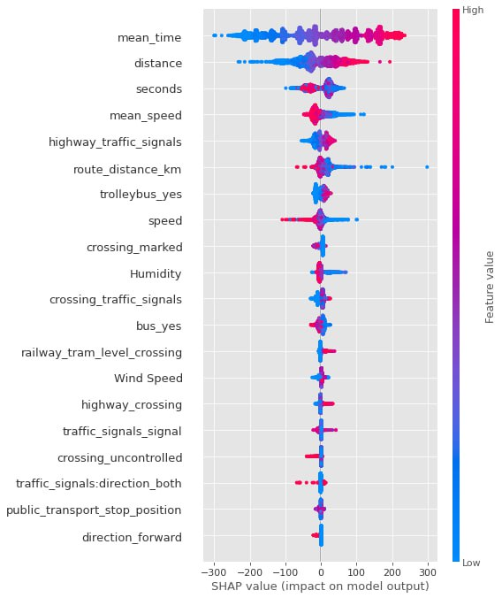

#  4NN team 🧨

Привіт!
Ми команда 4NN і ми готові презентувати наше рішення :)
Повний програмний код знаходиться за шляхом Model.ipynb

## Data sources

- Kaggle input data (https://www.kaggle.com/competitions/int20h-2023-hackathon/data)
- OpenStreetMap (https://www.openstreetmap.org/)
- Weather (https://www.wunderground.com/)

## Preprocess

Окрім коректної роботи з різними сорсами ми використовуємо feature engineering для створення 5 нових фіч

- seconds - time of a day
- distance – sum of the lengths of the nodes
- mean_speed - average time of speed in the city for every 30 minutes in a day (peak hour // traffic jams)
- mean_time - the average travel time on each interval
- speed - average speed across all nodes for a specific order

## Model

- В якості моделі ми використовуємо TabNet та XGBoost: {'max_depth': 3, 'min_child_weight': 4, 'gamma': 0.15, 'colsample_bytree': 0.85, 'subsample': 1.0}
- В якості метрики RMSE.
- Використовуємо cross-val.
- Використовуємо Optuna.

При навчанні моделі ми отримали метрику RMSE, що дорівнює 120.49735

## Results

Тепер використовуємо SHAP для того щоб отримати feature importance разом зі знаком змінних, що розуміти в яку сторону вони мають вплив:
(звісно і сюди берем cross-val, адже feature-importance змінюється від моделі до моделі)

SHAP показує вплив (знак) на результат моделі та feature importance кожного фактору і сортує їх від найвпливовішого до найменьшого: 
- найбільш впливовий фактор mean_time, цей параметр відповідає за середній час проїзду на кожному проміжку.
- наступний за важливості параметр distance - сума довжини маршрутам по нодам.
- наступний параметр seconds, цей параметр є показником що відповідає за час доби.
- наступний параметр mean_speed - параметр що показує середню швидкість по місту з інтервалом в 30хв. Концептуально відображає затори та час пік.
- highway_traffic_signals - параметр що відображає кількість traffic_signals на маршруті.
- route_distance_km - довжина маршруту в кілометрах.
- trolleybus_yes - відображає чи їздять тролейбуси по даному маршруту.
- speed - середня швидкість по всіх нодах для певного замовлення.
- crossing_marked - кількість пішохідних переходів на маршрутів.
- humidity - вологість повітря.
- crossing_traffic_signals - кількість світофорів.
- bus_yes - відображає чи їздять автобуси по даному маршруту.
- railway_tram_level_crossing - чи є перетин з трамвайними рейками.
- wind speed - швидкість вітру.
- highway_crossing - цей тег призначений для визначення місця переходу вулиці для пішоходів та велосипедистів.
- traffic_signals_signal- цей параметр відповідає за світофори.
- crossing_uncontrolled - неконтрольовані пішохідні переходи.
- traffic_signals_direction_both - рух по дорозі у 2 напрямках.
- public_transport_stop_position- зупинки громадського транспорту.
- direction_forward - рух по дорозі у одному напрямку.

## Next Steps

- Подумати як можна враховувати послідовності через seq2seq моделі подій.